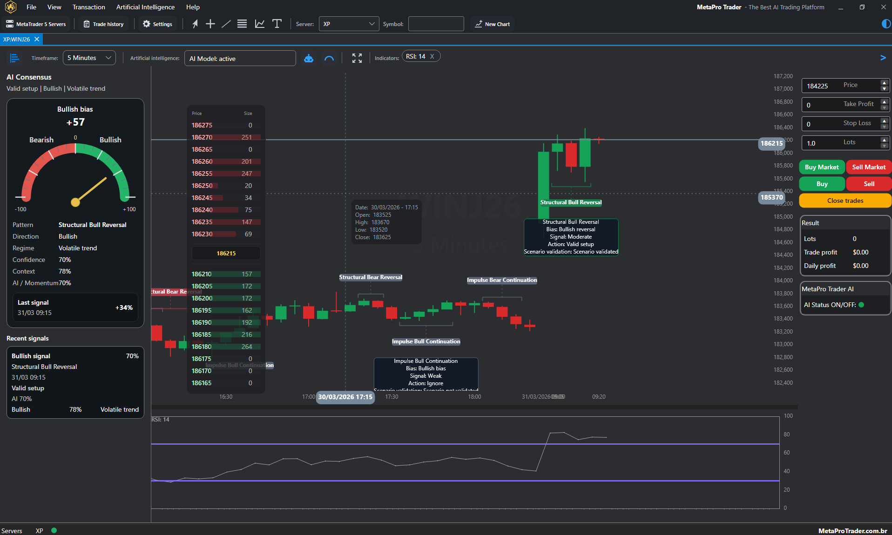

  

<h1 align="center">MetaPro Trader</h1>

  AI-powered desktop trading platform, built with native support for MetaTrader 5.

  

  

  

## Overview

MetaPro Trader is a professional desktop trading workstation that combines MetaTrader 5 connectivity, advanced charting, technical analysis tools, AI-assisted pattern intelligence, and release automation in a single cross-platform application.

It is designed for traders and teams who want a richer trading environment with customizable charts, order monitoring, indicator workflows, secure credential handling, and integrated model training pipelines.

## Highlights

- MetaTrader 5 server integration with multi-server workflow support
- Advanced chart workspace with drawing tools, Fibonacci tools, text annotations, and technical overlays
- Dedicated indicators window for configuring and applying chart studies
- Order and trade monitoring interface with filtering and summary views
- AI training and retraining workflows
- Pattern detection, scoring, calibration, and operational decision support services
- Over 50 customizable technical indicators optimized
- Connect simultaneously to multiple MetaTrader 5 servers
- Risk management
- Market analysis
- Automatic update
- Cross-platform packaging scripts for Windows, Linux, and macOS
- Built-in language support for English and Portuguese (Brazil)

# 

## Why MetaPro Trader

MetaPro Trader was built to deliver a modern trading desktop experience that goes beyond basic chart viewing. The platform brings together chart interaction, order visibility, technical studies, AI-assisted decision tooling, and production-ready release automation in one cohesive application.

## Getting Started

- https://www.metaprotrader.com.br

## License

The MetaPro Trader licenses are proprietary and are specified on the official MetaPro Trader website.